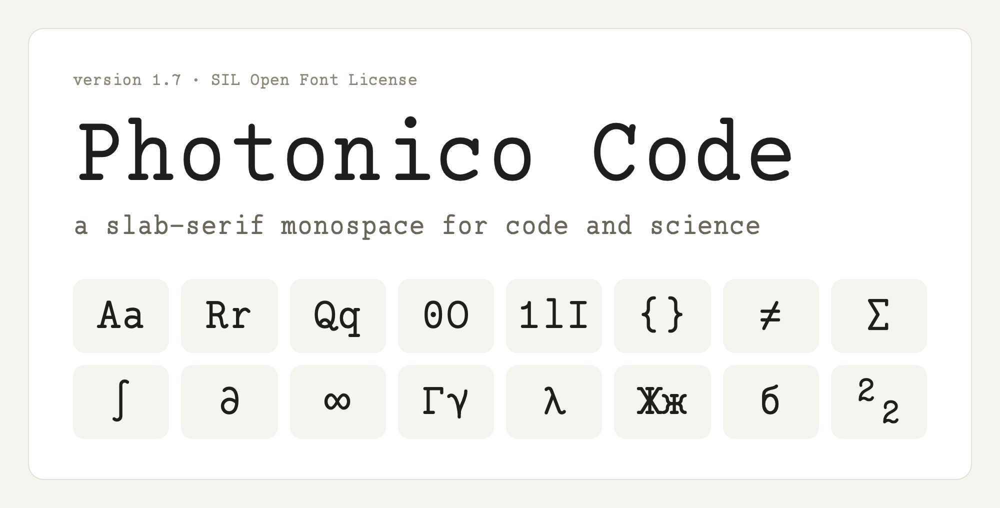
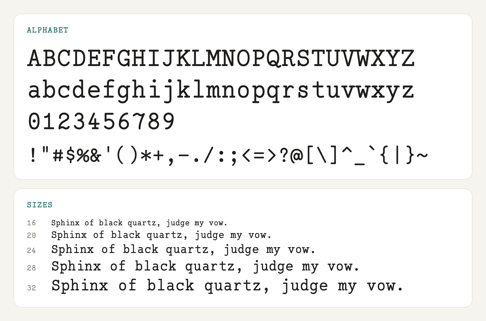
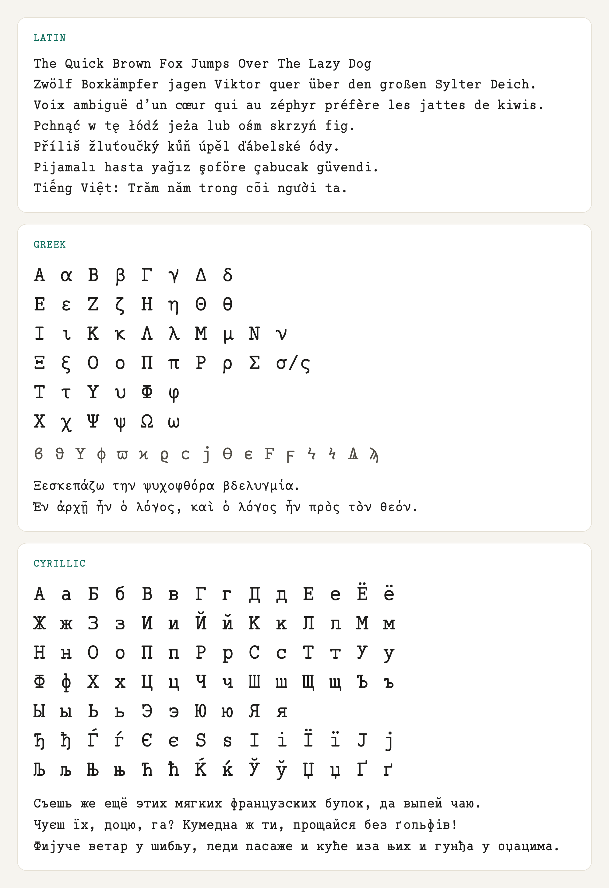
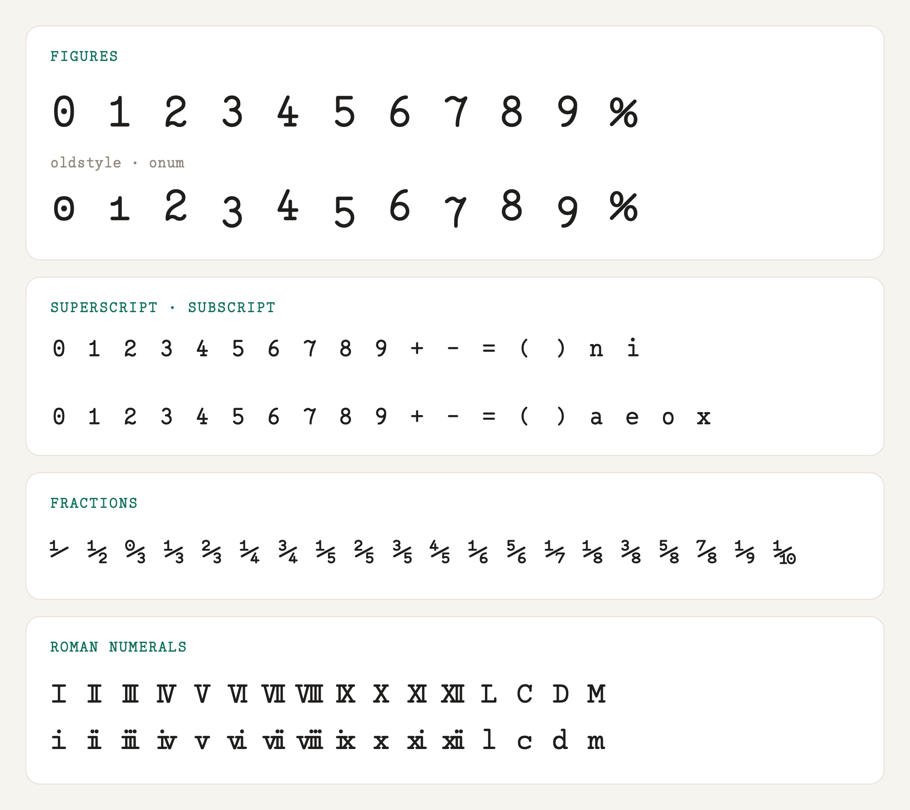
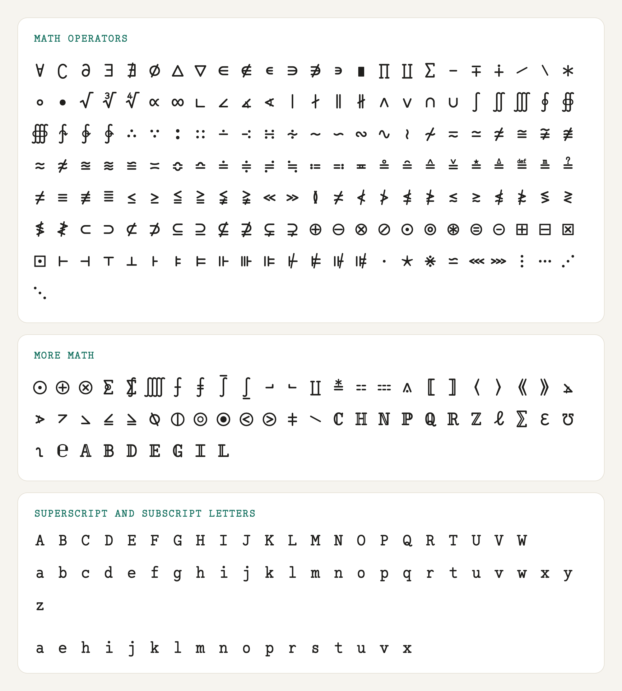
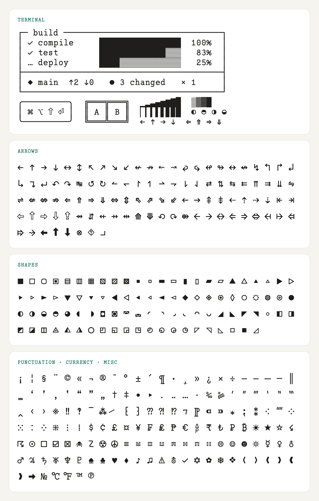
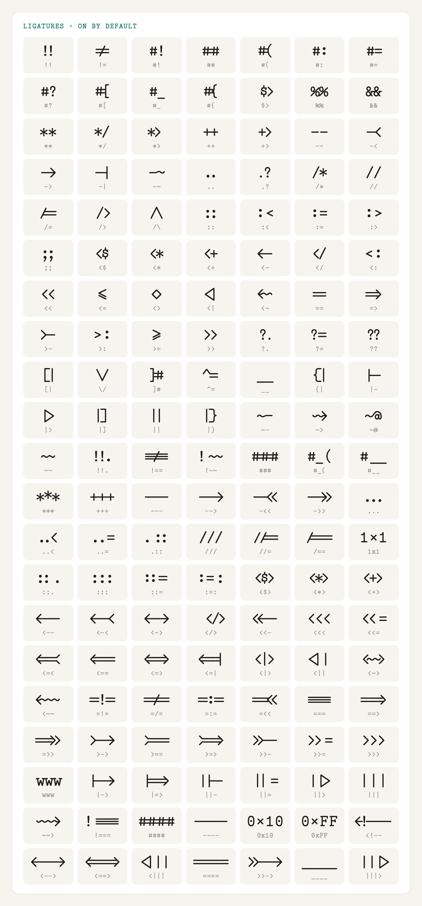
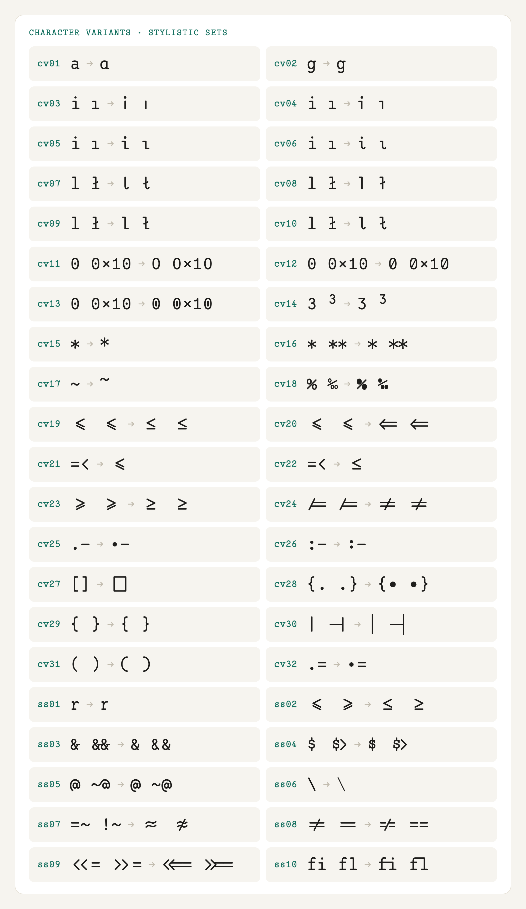
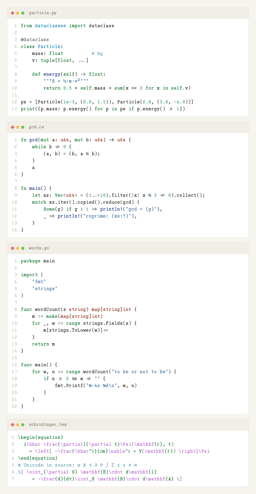

# Photonico Code



A free, monospaced slab-serif font for programming and scientific writing. It is built on [Fira Code](https://github.com/tonsky/FiraCode), keeps its ligatures and features, and covers Latin, Greek, Cyrillic and a large set of math symbols.

Made by Lu Niu.

## Install

- Download the latest `.ttf` from [Releases](https://github.com/Photonico/Photonico_Code/releases/latest).

## Characters











## Ligatures



## Character variants



To use them in VS Code:

```json
"editor.fontFamily": "'Photonico Code'",
"editor.fontLigatures": "'cv01', 'ss02'"
```

## In code



For VS Code, it pairs well with the [Photonica](https://marketplace.visualstudio.com/items?itemName=ConAntares.Photonica) theme.

## License

[SIL Open Font License 1.1](LICENSE)

## Acknowledgements

- [Fira Code](https://github.com/tonsky/FiraCode)
- [DSE Typewriter](https://webonastick.com/fonts/dse-typewriter/)
- [Maple Mono](https://github.com/subframe7536/Maple-font)
