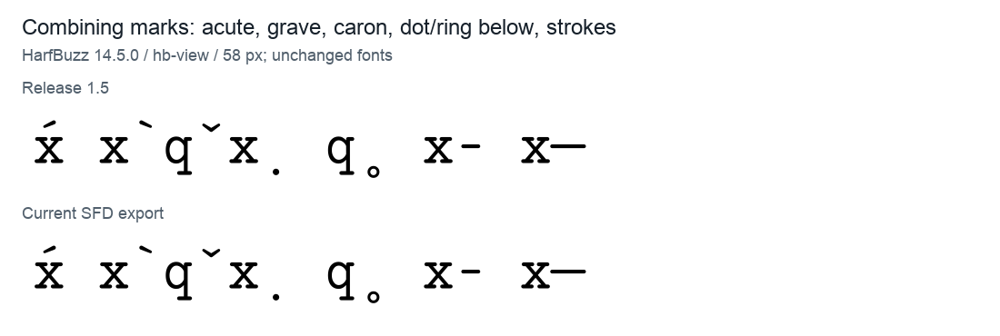
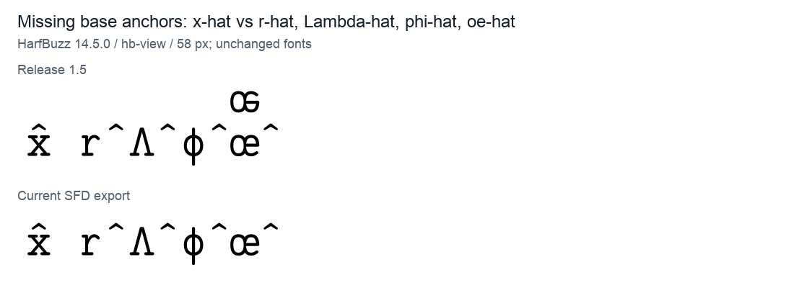
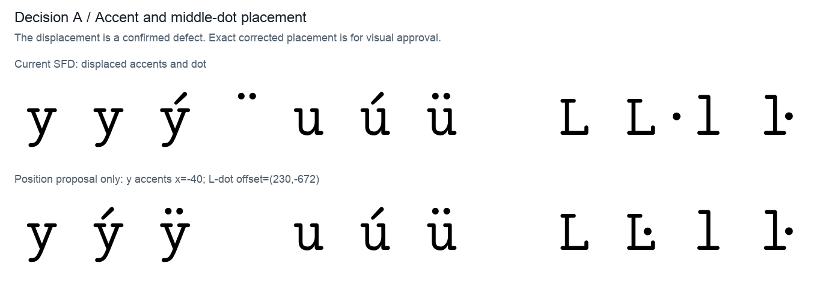
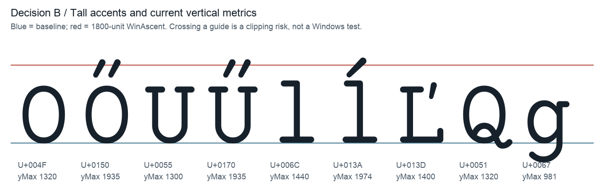
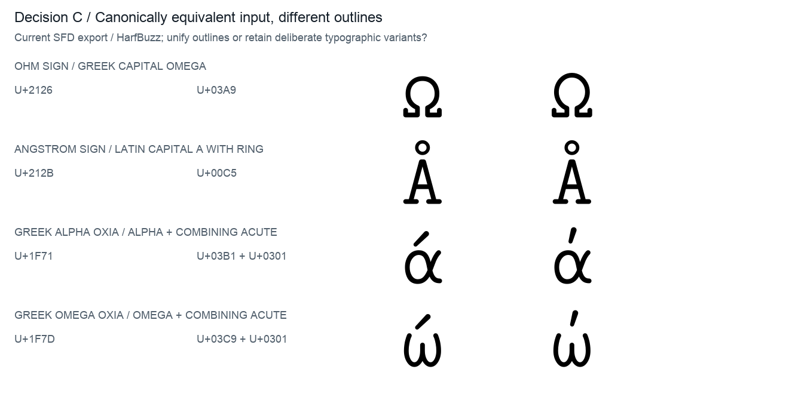
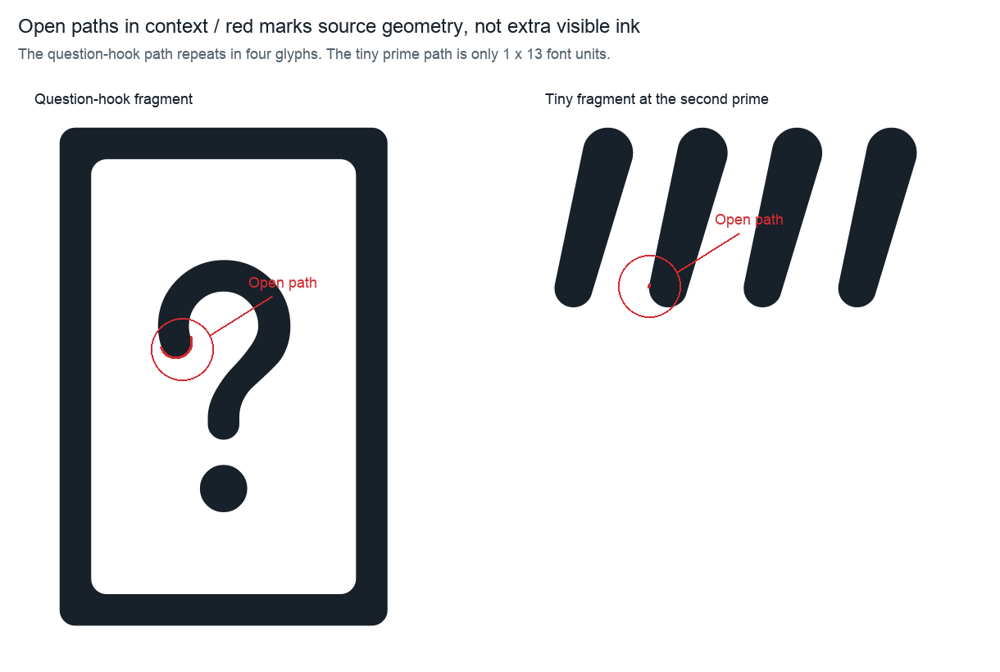

# Photonico Code 当前源码检查

> 历史检查快照：结论与源码行号对应当时的字体版本。报告已从 `audit/` 迁移；旧复现命令与未单独展开的中间文件完整保存在[原始证据压缩包](../archive/font-audit-2026-09-29.zip)，解压后可还原原目录。最新结论请看 reports 的总索引。

检查日期：2026-09-29。**主对象为 `00_Regular.sfd`，不是旧发布字体。** 使用 FontForge 20251009 将未改动源码导出为 `generated/Photonico-current.ttf`，再用 fontTools 4.61.1、HarfBuzz 14.5.0、Fontconfig、macOS CoreText 检查。历史 20 个 TTF 仅用于对照。原 SFD 和 Releases 均未修改；`position-proof.ttf` 是供看图判断的局部位置试样，不能作为完整修复版发布。

## 结论

`œ` 的上移副本、连续反引号的替换问题，在当前源码中均已修好。尚未解决的主要问题包括重音与中点错位、美元连字重复及宽度异常、组合附加符定位、等宽标识、版本元数据和轮廓杂点。新增发现 `Ç` 的两个组件同时争用字形度量。

目前不宜直接把当前源码导出作为三平台正式版。需要先处理已确认的问题，再用 Windows/Linux 原生应用验证小字号、字体选择和裁切。自动校验的轮廓警告不等于同样数量的可见错误，不建议照着旧报告的数字一键修改全部轮廓。

## 对原截图逐项复核

1. **œ：源码已修复。** [源码 16654 行](../../00_Regular.sfd#L16654)前景只有 3 个正常闭合轮廓，可见边界为 `(-80,-20,1268,980)`。当前导出已没有上方副本；1.5 TTF 仍有。[渲染对照](visuals/oe-comparison.png)。辅助层中保留的历史图形不属于成品输出，不能当作未修复的证据。

2. **ý / ÿ：仍存在。** [18206 行](../../00_Regular.sfd#L18206)及 [18232 行](../../00_Regular.sfd#L18232)重音组件横向位移都是 `2592`，最右分别到 `3432 / 3517`，而单格宽仅 `1200`。分解输入 `y + acute/dieresis` 也会进入同一个坏字形。错位是确定错误；修正后的精细位置请看下面 A 试样。

3. **Ŀ：仍存在。** [10554 行](../../00_Regular.sfd#L10554)的 dotaccent 组件位移为 `(1272,-672)`，圆点进入下一格。候选 `(230,-672)` 放在 A 图中，尚未写回源码。

4. **美元连字：仍存在。** `dollar.spacer` [65046 行](../../00_Regular.sfd#L65046)宽 `1206`，并且有完整 `$` 轮廓；`dollar.ss04` [65087 行](../../00_Regular.sfd#L65087)也宽 `1206`。默认排版 `<$>` 总宽 `3606`，`$>` 为 `2406`，均多 6 单位；`ss04=1` 下普通 `$` 也多 6。应清空 spacer 的前景并恢复这两个字形宽度为 `1200`，随后复测连字总宽。[实测图片](visuals/dollars-comparison.png)。

5. **等宽元数据异常，但平台结论须区分。** 当前导出 `post.isFixedPitch=0`，PANOSE 全 0。macOS 原生 CoreText 实测 `monoSpace=false`；本机 Fontconfig 实测 `spacing=100`，即它仍认定等宽。Windows Terminal 过滤情况尚未原生验证。修正两个 1206 宽度后仍应重新检查导出标志，再决定是否设置 `isFixedPitch`；正确的 0 宽组合符不应强改为 1200。PANOSE 可以补充一致分类，但不能代替修好实际字宽。[原生输出](metadata/coretext_scan.txt)。`post` 字段语义参见 [OpenType 规范](https://learn.microsoft.com/en-us/typography/opentype/spec/post)。

6. **字形 hinting 全空属实。** 当前导出 `0/2230` 个字形含 TrueType 指令，但仍有 `fpgm=3605 bytes`、`prep=214 bytes`、86 个 cvt 项；`gasp=15` 对所有字号请求网格拟合与平滑。旧报告说从 1.2 起为空，本次发现 1.1 就已为空。不能仅凭表值断言 macOS 完全不受影响，或断言 Windows 的某个 13px 字一定变粗。[11–24px 当前输出](visuals/small-sizes.png)仅是本机 hb-view 的样本，不是 Windows 截图，也不是有／无 hinting 的受控比较。应在清理轮廓后比较自动 hinting 与干净的无 hinting 两种输出；`gasp` 是栅格化建议而非跨平台显示保证，见 [规范](https://learn.microsoft.com/en-us/typography/opentype/spec/gasp)。

7. **西里尔码页虚报仍在。** [62 行](../../00_Regular.sfd#L62)声明 1251、866、855，但当前 cmap 在 U+0400–045F 为 `0/96`。FontTools 重算码页恰好需要去掉这三位。不需要为消除虚报而扩充整套西里尔字母。具体字体回退效果依赖应用，本次没有复现所有旧 Windows 程序的方框行为。[OS/2 规范](https://learn.microsoft.com/en-us/typography/opentype/spec/os2)。

8. **版本号仍不一致。** 第 7 行 `1.6_alpha`，第 14 行 `sfntRevision=0x0000199a ≈ 0.100006`，第 8282 行仍为 `Version 1.4` 和 `1.4; PhotonicoCode-Regular`。当前导出因此仍带旧名称记录。发布时统一源码版本、数字 revision、name ID 3/5 与文件名；本次没有把字体缓存故障当作已复现结果。

9. **孤点仍在，当前数量是 48 个字形／76 个单点轮廓。** `G` 有 12 个，最低孤点到 `-911`；`<!--` 连字有 `(-3230,2238)`。它们通常不产生填充墨迹，但导出 TTF 的边界会被污染。建议清除确认的无面积孤点，再重算边界。[完整坐标清单](source/source_geometry.json)。这与截图的 51 个字形不一致，报告按当前前景统计。

10. **方向／交叠告警仍有，但旧数量和一键修复建议不宜照搬。** FontForge 对当前 SFD 强制重新校验得到：395 个方向标记、230 个自交／相交标记、64 个翻转组件标记。集合可能重叠，不可相加；也不能当作 395 个肉眼错误。辅助层、镜像组件、故意交叠和输出轮廓需要区分。应按字形局部检查并比较修复前后的轮廓与栅格图，不能直接全选 Remove Overlap / Simplify。[FontForge 校验定义](https://fontforge.org/docs/scripting/python/fontforge.html#fontforge.glyph.validation_state)。

11. **超出 ascent 的音标仍在。** `Ő / Ű` 顶部为 `1935`，`ĺ` 为 `1974`，而 Win / Typo / hhea ascent 均为 `1800`。注意 `ĺ` 是小写带锐音符 l，并非所有问题都在大写。超界与潜在裁切已确认，实际 Windows GDI 裁切未实测。不要将框线、块元素、分段括号也全部压回行框。见下面 B 图。

补充：连续反引号在当前源码导出使用普通 `grave`，已修复；1.5 用的是 `grave.case`。[反引号对照](visuals/graves-comparison.png)。盲文 U+2800–28FF 为 `0/256`，是覆盖范围选择，不是已有轮廓损坏。只有确实希望直接覆盖依赖盲文的终端图形时，才应将其纳入新增字形工作。

## 新增问题

### 组合附加符错误占格：高优先级

U+0323（下点）、U+0325（下圈）、U+0335/U+0336（划线）宽度均为 `1200`，而且没有正确的 mark 分类与附着。源码对应第 112006、112097、83991、84024 行。

HarfBuzz 将 `x̣`、`q̥`、`x̵`、`x̶` 排成 `2400` 单位：附加符跑到下一格；`x̶x` 总宽 `3600`，两字母文本多占一格。CoreText 下下点／下圈仍错误占两格。**修复需要同时处理零宽度、mark 分类和锚点，不能只改 Width。**

### mark 与 base 锚点缺失：高优先级

`gravecomb`（83577 行）、`uni030C`（83709 行）缺少 mark anchors；`r`（16965）、`Lambda`（21898）、`phi1`（30370）、`oe`（16654）等缺少 base anchors。

正常 `x̂` 的帽子得到横向修正 `dx=-1200`，`r̂ / Λ̂ / ϕ̂ / œ̂` 的帽子为 `dx=0`，因此落到下一格。`x̀ / q̌` 也发生类似问题。CoreText 的启发式定位可掩盖其中一部分，说明跨引擎结果不一致，字体自身仍应补全定位。

扫描 683 个已编码拉丁／希腊字母加 circumflex，得到 108 组定位缺失候选；其中含少用组合，不能理解为 108 个常用文本错误。[候选清单](shaping/latin_greek_mark_base_gaps.json)。

### Ç 的组件度量冲突：中优先级

[9056–9057 行](../../00_Regular.sfd#L9056)的 cedilla 与 C 同时启用 `USE_MY_METRICS`。导出后二者 flags 都为 `0x1204`，而组件 LSB 分别为 `329 / 110`。FontForge 因此明确报 `Use-my-metrics flag set on at least two components in glyph 138`，并汇总为 `Bad glyf or loca table`。

建议只让基字 C 提供度量。当前字体仍能解码和显示，不能将该诊断夸大为整个文件无法使用。[组件证据](metadata/current_multiple_metrics.json)；[该标记的规范语义](https://learn.microsoft.com/en-us/typography/opentype/spec/glyf)。

### 低优先级与待逐字检查项

- 六个字形含多点开放路径：`.notdef`、`backslash.ss06`、`uni2BD1`、`uni2370`、`uni225F`、`uni2057`。进一步试样确认，仅补闭合标记后六个字号均逐像素不变，应归为结构整理。反斜线的开放路径是完整笔画，绝不能删除；详细证据与取舍见下面 E。
- `head.flags` 声明所有字形 LSB=xMin，但有 142 个相差 1 单位。重算 maxp 后 maxp 各项不变，只会清除该不实标志；优先级低于可见字形错误。
- `uniD53E` 名称与实际正确映射的 U+1D53E 不一致；建议以后改为 `u1D53E`。`uni216b` 名称与 U+216C 也不一致。当前 cmap 正确，不应误改 Unicode 编码来迎合名称。
- 当前无已发现的表校验和错误；fontTools 能解码全部表、绘制全部字形。这不能抵消 Ç 的独立验证错误，也不构成所有平台全部通过的声明。

## 需要作者判断的事项与附图

### A. 重音和中点的精确位置

上排是当前源码，下排是仅在临时试样中将 y 重音横向位置改为 `-40`、Ŀ 圆点位移改为 `(230,-672)` 的效果。错位必须修；**是否接受下排的视觉位置由你决定**，尤其 Ŀ 的圆点高度及其与横笔的距离。也可以保留“归位”方向，再调整位置。

### B. 高音标与行距

红线表示现有 1800 上界，蓝线是基线。这是几何图，不是裁切截图。

可以选择保留当前音标造型，清理孤点后调整裁切相关度量；或把这几种音标压低／缩小，保持紧凑行框。我倾向先保留造型并验证合理的 Win metrics，同时尽量保留既有 Typo/hhea 行距；旧应用可能仍因此增大行距，须原生验证，不能保证“只增裁切范围而完全不变行距”。如果你更重视紧凑终端排版，可以选择调整音标形状。

### C. Unicode 等价输入是否统一外观

同一规范等价字符，目前可能根据输入码点选到不同轮廓。例如 `Ω` 与 `Ω` 的高度不同，部分希腊 oxia/tonos 也不同。下图每行左、右分别是两种等价输入。

我倾向统一等价输入的外观，避免复制或规范化后字形发生明显改变；但采用哪一个既有造型，需要你选。若这些差异是有意设计，也请指出用途，通常更适合通过样式替代提供。不能仅因 25 组排版输出的 glyph 名不同，就宣称有 25 个错误。Unicode 对欧姆符号与 Omega 的关系有明确说明：[Unicode FAQ](https://www.unicode.org/faq/casemap_charprop.html)。

### D. 小字号与 hinting 策略

[当前小字号图](visuals/small-sizes.png)可用于判断笔画偏好，但不足以替你决定跨平台策略。下一轮在主要轮廓修复后，应给出同字号、有／无自动 hinting 的原生 Windows 和 FreeType 对照，再选发布方案。此次不依据 macOS 单机预览承诺 Windows/Linux 的效果，也不擅自改造笔画。

### E. 开放路径的保守整理或局部删除

红色标出源码里的小段，不是字体实际输出的红色墨迹。六个字形仅补闭合标记后，在 13、16、24、72、240、1200 px 全部逐像素不变。四个问号相关字形的小段删除后，仅有极小的边缘抗锯齿变化；我建议先保守闭合，如果你希望彻底清除冗余，再删除这些片段。`uni2057` 的微小段仅 1×13 单位，删除后上述六字号均无像素变化；`backslash.ss06` 则必须保留整个路径，只补闭合标记。[三方案图](source/decision-open-contours.png)与[详细测试](source/open_contour_findings.md)。这些对照限定于本次栅格器和字号，不推断所有打印／转换器都完全相同。

## 检查范围与证据

- 当前 SFD：2229 个字形；标准导出：2230 个字形、1784 个 Unicode 映射。导出器会补充控制字形，因此两者数量不同。
- ASCII 可打印字符 95/95，Latin-1 U+00A0–00FF 96/96，Box Drawing 128/128，Block Elements 32/32。Combining Diacritics 23/112；Braille 0/256。覆盖不足与已有字形错误分别处理。
- 61 组编程样本，default 与 `calt=0` 对照；语料中仅美元样本出现额外宽度。
- 枚举 59 个 GSUB feature；除 `aalt` 外对 58 项运行语料与单字符宽度检查。这不是所有上下文排列的穷举。
- 检查 23 个已编码组合符、493 组有已覆盖规范分解的输入，以及 683 个拉丁／希腊基字的 circumflex 附着。
- 全量表解码／校验和／轮廓读取、FontForge 校验、CoreText 字体属性与排版抽查、本机 Fontconfig 分类。
- **未完成的环境验证**：Windows DirectWrite/GDI/Windows Terminal 原生显示、原生 Linux 桌面／终端、目标打印/PDF 流程。HarfBuzz、Fontconfig 在 macOS 的测试不能冒充 Linux 实机测试。

可重复运行的脚本：`source/inspect_source.py`、`source/foreground_check.py`、`metadata/audit_metadata.py`、`metadata/coretext_check.swift`、`shaping/audit_shaping.py`、`render_probes.py`、`make_position_proof.py`、`render_decisions.py`。各分报告有精确命令。图片没有使用系统后备字体替代被测字形；标签使用 Arial。

建议处理顺序：先确认 A 的位置、修正已确认的字形／组合定位／美元宽度／Ç 组件问题；再清理确认为无面积的孤点，逐字处理真正影响轮廓的告警；随后统一等宽和版本元数据；最后根据 B/C/D 的选择完成跨平台试样与原生验收。现有 `scripts/width.py` 会把所有零宽符号也打印为异常，应在建立持续检查时区分普通字符、组合符与连字输出总宽。
