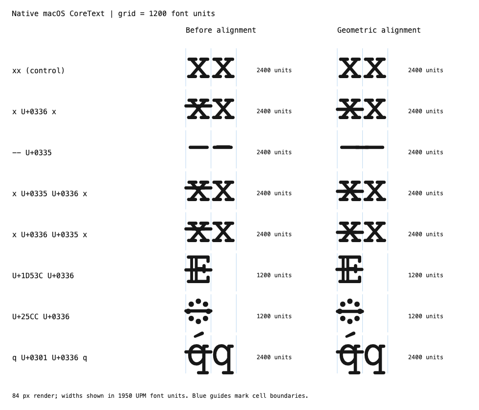
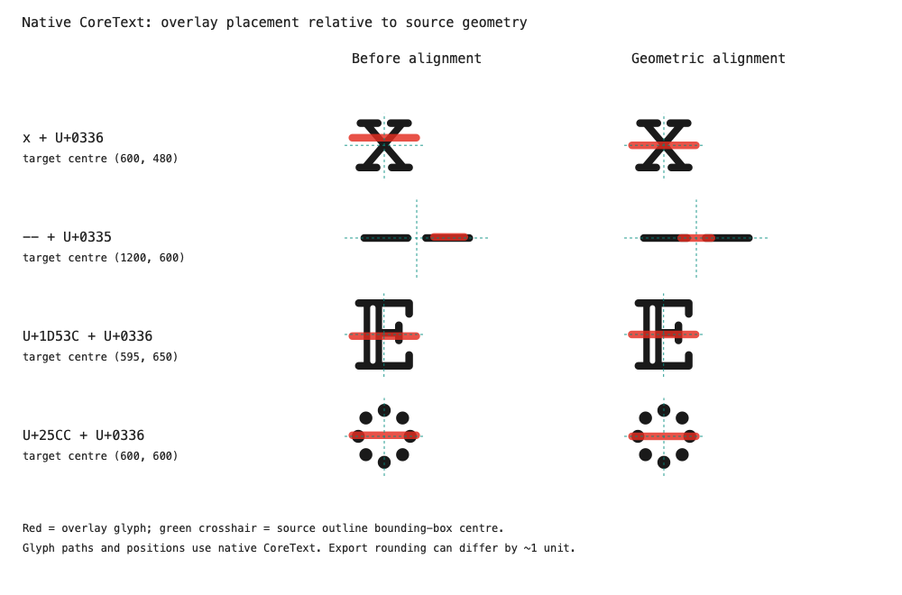

# 横杠对齐几何中心

按本次指定，将截图中的 `x`、`--`、`𝔼`（U+1D53C）、`◌`（U+25CC）与 U+0335 / U+0336 的叠加位置，对齐到**基字前景轮廓包围盒的中心**。这里使用几何中心，不是视觉重心或某一笔画的中心。普通 `-` 也同步调整，覆盖关闭连字的情况。



图左是本次调整前，图右是调整后。蓝线标示每格 1200 字体单位；字符组合的总宽保持不变。



红色为组合横杠，绿色十字为源字形的几何中心；路径和位置均取自原生 CoreText。

## 本次调整

- `x`：横杠中心从高度 620 降至 480，水平中心仍为 600。
- `𝔼`：横杠中心从 `(600,620)` 移到 `(595,650)`。
- `◌`：横杠中心从高度 620 降至 600。
- 普通 `-`：横杠中心从高度 620 降至 600。
- `--` 连字：在连字自身坐标中，横杠中心从 `(600,620)` 移到 `(0,600)`。该连字的轮廓横跨自身原点两侧；整体几何中心不在最后一个字符格的中间。

**`--` 的外观变化是预期的：** 居中的 U+0335 会连接原本两笔之间的空隙，形成连续长横。关闭连字时，组合横杠仍只附着在最后一个普通 `-` 上。

## 修改范围

只改了 `00_Regular.sfd` 中上述五个字形的 `Anchor-5`，完整差异见 [source.patch](evidence/source.patch)。

两种组合横杠的原有墨迹中心为 `(600,620)`，mark 锚点为 `(600,0)`。保留这套坐标约定，基字锚点设置为「目标几何中心减去 `(0,620)`」，即可让横杠中心准确落到目标位置。因此源文件中的锚点纵坐标可以是负数；它表达附着偏移，不代表横杠最终显示高度。

构建后的两版字体，`glyf`、`hmtx`、`GSUB`、`cmap`、`GDEF`、`fpgm`、`prep` 均逐字节一致；只有 `GPOS` 和随构建更新的 `head` 不同。导出的 [GPOS 差异](evidence/gpos.patch)也恰好只有五处基字锚点。源文件哈希及构建校验见 [provenance.json](evidence/provenance.json)。

导出 TTF 中少数字形原有的 LSB / xMin 舍入差会让墨迹水平中心相差 1 单位；本次保留原轮廓，按 SFD 的精确前景几何计算锚点。

## 验证结果

- HarfBuzz：20 个目标样例与 7 组控制文本，分别测试默认连字、关闭 `calt`，并对照修改前后。两种横杠互换、双横杠反序均保持正确定位与字宽。普通编程文本、美元、反引号及其他重音的字形与位置不变。[原始结果](evidence/harfbuzz-results.json)
- macOS 原生 CoreText：截图各组合仍保持 1200 / 2400 单位总宽，第二个 `x` 仍从 1200 开始。横杠纵向位置与目标几何中心一致。[修改前](evidence/coretext-before.txt) · [修改后](evidence/coretext-after.txt) · [实际墨迹中心](evidence/center-measurements.txt)

## 复现

在仓库根目录，使用装有 fontTools 的 Python 运行：

```sh
python scripts/build.py /tmp/PhotonicoCode-Regular-aligned.ttf
python reports/overlay-alignment/evidence/check-harfbuzz.py BEFORE.ttf /tmp/PhotonicoCode-Regular-aligned.ttf
```

`BEFORE.ttf` 为本次调整前的构建产物，哈希见 provenance；脚本还要求 PATH 中可用 `hb-shape`。CoreText 验证与绘图源码也保存在 [evidence](evidence/) 中。

本次覆盖 macOS 原生 CoreText 与 HarfBuzz 排版；尚未在 Windows、Linux 原生应用中复测。
