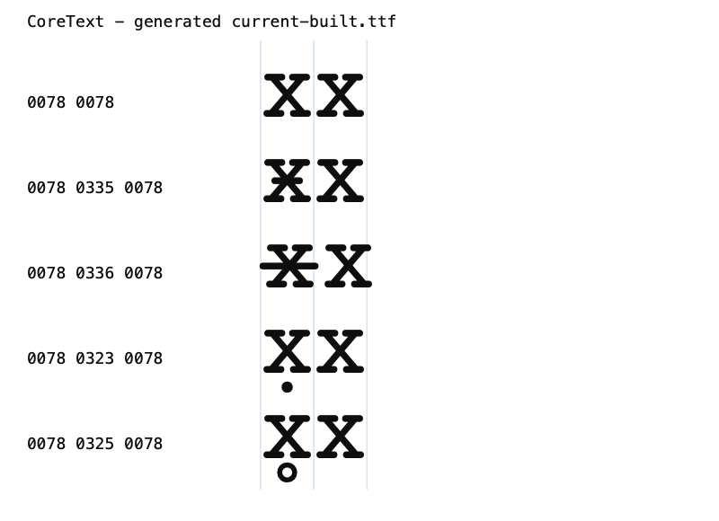
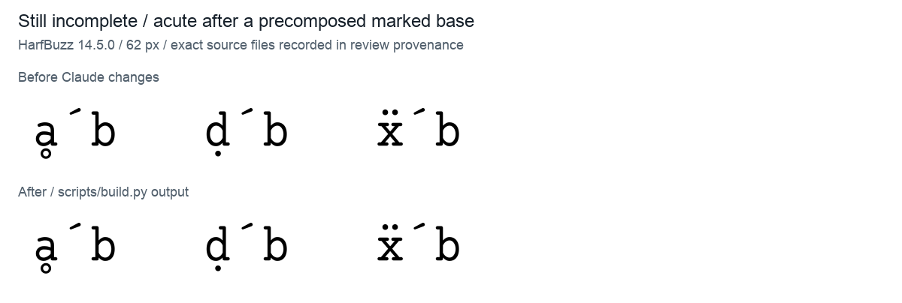
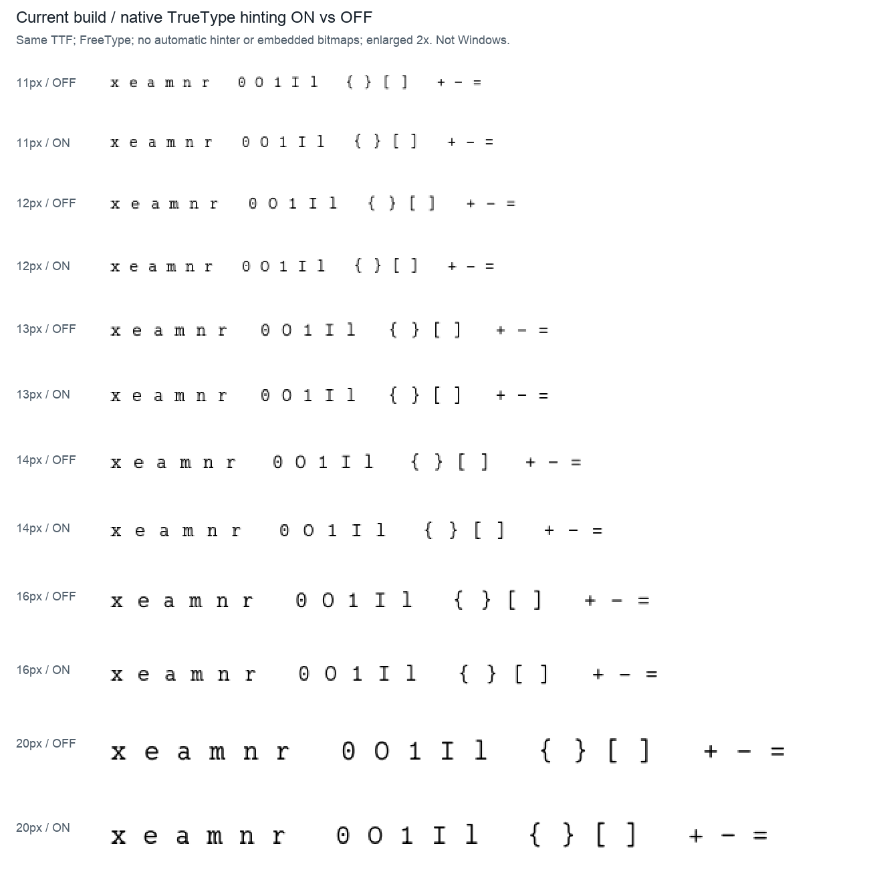

# Claude 修改后的复查

> 历史检查快照：结论与源码行号对应当时的字体版本。报告已从 `audit/` 迁移；旧复现命令与未单独展开的中间文件完整保存在[原始证据压缩包](../archive/font-audit-2026-09-29.zip)，解压后可还原原目录。最新结论请看 reports 的总索引。


2026-09-29；主对象为修改后的 `00_Regular.sfd` 和新增 `scripts/build.py`。比较基线为上次审查保存的源文件／导出字体。此次未修改源字体、构建脚本或历史发布字体。

**结论：这批修改有效，未发现新增的几何或已测编程连字回归。两类旧组合定位问题尚未修完整；正式输出必须经过构建脚本，直接 FontForge 导出仍有宽度表问题。**

## 优先处理的剩余问题

### 1. CoreText 下长组合删除线仍破坏等宽（高优先级，旧问题未修完整）

当前 `scripts/build.py` 生成的字体中，`x̶x` 在 HarfBuzz OpenType 下总宽为正确的 `2400`，但在 macOS 原生 CoreText 下是 **2592**。第二个 x 起点为 **1392**，应为 **1200**。短划线在部分上下文也有问题，例如 `--̵` 的 CoreText 总宽是 `2750`，应为 `2400`。



蓝线为每个 1200 单位字符格的边界。第三行 U+0336 的第二个 x 发生右移；普通 xx、下点、下圈例子正常。图片来自原生 CoreText，不是其他系统的模拟图。

定位：源码[第 468 行](../../00_Regular.sfd#L468)新增的 Overlay Marks lookup，以及[第 79707 行](../../00_Regular.sfd#L79707)、[第 79741 行](../../00_Regular.sfd#L79741)的 `dx=-1200`。它们属于固定位置调整，没有提供真正的 mark-to-base 附着；CoreText 仍介入后备定位。

已经验证修复方向：只在诊断字体中使用真正的 GPOS MarkToBase 后，HarfBuzz 和独立原生 CoreText 都恢复为总宽 `2400`、第二个 x 起点 `1200`。应为两个 overlay 建立专用锚点，覆盖适用基字及变体，并保留其他现有定位。诊断字体故意替换了部分布局表，只能证明方向，不能发布。

证据：[原生测量](metadata/coretext_built_only.txt)、[诊断字体的原生测量](metadata/coretext_diagnostic.txt)、[完整 shaping 报告](shaping/README.md)。

### 2. 预组合字形继续加重音时，锚点仍缺失（中优先级，旧问题未修完整）

普通 `r̂ / Λ̂ / ϕ̂ / œ̂` 已修好，但以下输入仍会把最后一个重音放到下一格：

- `ḁ́`：a + 下圈 + acute，会先合成为 `uni1E01`；该字形没有后续重音锚点。源码[107774 行](../../00_Regular.sfd#L107774)。
- `ḍ́`，包括分解输入 `ḍ́`：合成为 `uni1E0D` 后，acute 仍是 `dx=0`。源码[108018 行](../../00_Regular.sfd#L108018)。
- `ẍ́`：合成为 `uni1E8D` 后同样有问题。源码[103245 行](../../00_Regular.sfd#L103245)。



仅给普通 a/d/x 添加锚点不能覆盖这些情况，须检查实际被选中的预组合字形。683 个拉丁／希腊基字加 circumflex 的检查，定位缺失候选从 **108 降为 72**；包含少用组合，不能理解为 72 个同等严重的常见错误。更复杂的多重上音标堆叠也未完整支持，应按希望支持的组合明确范围。

### 3. 构建脚本成为必要的发布入口（流程要求，不是脚本修复失败）

两条输出路径已实际运行：

- **直接 FontForge 导出**：25 个源码中零宽的字形被写成 `1200`，包括组合符及 U+200B / U+FEFF。只有导出器补出的一个控制字形仍为 0。
- **`scripts/build.py` 导出**：正确还原所有源码宽度，得到 26 个零宽字形；其他字形均为 1200。之后自动 hinting 成功。

脚本[78–84 行](../../scripts/build.py#L78)的宽度恢复步骤确实必要，而且本次实测有效。常见 HarfBuzz / CoreText 排版会自动处理很多组合符和不可见字符，可能掩盖原始 hmtx 错误，所以不能把“简单样例看起来正常”当作直接导出无问题。

建议在仓库 readme 明确该构建入口、依赖与输出文件，避免以后从 FontForge 菜单直接导出后发布。现有脚本检查的是宽度和表存在性，无法捕获上面原生 CoreText 的排版问题。

本机本次使用的构建命令：

```sh
/opt/homebrew/Caskroom/miniconda/base/envs/py314/bin/python scripts/build.py audit/review-claude/generated/current-built.ttf
```

## 已确认修好的内容

- `ý / ÿ` 的重音从错误的 x=2592 改为 0，已回到本字上方；`Ŀ` 的圆点位移从 1272 改为 480。它比上一轮示意候选更靠右，但已不是原先跑到下一格中央的问题，具体位置属于造型取舍。[对照图](visuals/positions-comparison.png)。
- `dollar.spacer` 的多余轮廓清空；两个 1206 宽度改为 1200。`<$>` 总宽3600、`$>` 总宽2400，`ss04` 的 `$` 也恢复1200。[对照图](visuals/dollars-comparison.png)。
- grave/caron，以及下点、下圈的常见组合定位修好。`r̂ / Λ̂ / ϕ̂ / œ̂` 在 HarfBuzz 下正确附着。两个 overlay 的 HarfBuzz 表现也改善，但不能由此推断 CoreText 已通过。[对照图](visuals/marks-comparison.png)。
- **macOS 等宽属性已修好**：CoreText 从 `monoSpace=false` 变为 `true`，traits=1024；post=1，PANOSE family=2、proportion=9。它与实际复杂文本是否保持等宽是两个独立检查。
- 版本已统一为 `1.6_alpha`、数字 revision≈1.6；构建字体的名称记录附加正常的 ttfautohint 版本后缀，不再是旧的 Version1.4。
- 虚报的西里尔码页标志已移除；`Ç` 两组件同时提供度量的问题已消除，原来的 glyf/loca 汇总错误不再出现。
- **76 个孤点全部清除**；六处开放路径已处理。`G`、注释连字等由孤点造成的边界污染得到清理。
- 若干 Unicode 规范等价输入已统一使用相同轮廓，例如欧姆符号/Omega、希腊 oxia/tonos。[对照图](visuals/equivalents-comparison.png)。shaping 得到不同 glyph 名不等于外观仍不同，不能沿用旧报告的名称差异数量判断修复失败。
- 新构建已加入实际 TrueType 字形指令：**1627/2230 个字形**携带指令。复合／空白字形不必各自都有指令，不能要求计数必须2230。

## 轮廓改动有没有造成新问题

按 Unicode 和源码引用匹配后：2229 个源码字形全部保留，52 个名字是规范化改名，没有误删字符。导出仍是2230个字形、1784个Unicode映射。

使用 FreeType 显式关闭 hinting 和内嵌位图，在240px比较全部2229个字形：

- 1892 个逐像素完全相同。
- 303 个最多只有 1/255 灰阶差，另5个最大为2–7/255，属于极小边缘栅格差异。
- 29 个显著变化均对应预期的错位修复、spacer清空或规范等价轮廓调整。

**未发现新增挖空、缺失笔画或非预期的大形变。**该结论限于源几何比较及上述栅格验证，不等于所有字号／渲染器已穷举。

FontForge 方向告警395→94，相交告警230→235。新增相交标记主要来自已闭合的问号小片段和一个等价引用；不能将数字增加直接解释为新增可见错误。源码和栅格细节见[轮廓复查](source/findings.md)。

## 留给你判断的造型与原有待办

**重音／Ŀ 的当前位置**：[修改前后图](visuals/positions-comparison.png)。归位有效；圆点的横向位置、音标的视觉居中是否符合设计，需要你看图决定，不按个人审美给它记 bug。

**hinting 的粗细取舍**：下图对同一新字体显式开启／关闭原生 TrueType 指令，禁用自动 hinter 与内嵌位图，使用 FreeType 灰度渲染并最近邻放大2倍。ON/OFF 的变化是真实指令效果。小字号灰度和笔画粗细的偏好仍由你判断；这不是 Windows 的 DirectWrite/GDI 截图。ttfautohint 本身使用 FreeType 的自动拟合信息生成指令，见[官方说明](https://freetype.org/ttfautohint/doc/ttfautohint.html)。



**高音标边界尚未处理**：`Ő / Ű` 顶部1935、`ĺ` 顶部1974，Win ascent仍1800。这是原先待选择的度量／造型问题，本次没有改动；不能视为本次新增回归。[现状图](visuals/height-comparison.png)。Windows旧应用实际裁切仍需原生测试。

低优先级元数据问题还包括142个字形LSB与xMin相差1单位、head标志却声明全部相等。未观察到由此造成的显示故障。盲文覆盖仍未扩充，属于范围选择。

## 验证范围和文件

- 新旧源码语义比较、字符覆盖匹配、无hint全量字形栅格对比。
- 新旧及两种新导出的61组编程样本、58项非aalt GSUB feature、493组规范分解输入；这些测试未发现新增 shaping 回归。
- 683个基字附着检查、33组复杂组合探针、OpenType/CoreText对照及独立原生CoreText测量和图片。
- 两种新导出的全表解码、校验和、glyph读取与maxp重算通过；新增构建脚本实际运行通过；`git diff --check`通过。
- **尚未进行原生Windows/Linux应用验收**。Fontconfig/FreeType运行于macOS，不冒充Linux实机测试。
- 源码与脚本在检查前后hash一致。精确输入见[provenance.json](provenance.json)，构建日志见[build.log](generated/build.log)。

本次产物都在 `audit/review-claude/`，上次报告和图片未覆盖。分报告：[源码轮廓](source/findings.md)、[排版](shaping/README.md)、[元数据与构建](metadata/findings.md)。

建议下一步先补全 overlay 的真正附着，再处理计划支持的预组合字形锚点，把原生CoreText反例纳入构建后的回归检查；然后决定高音标和小字号方案，最后做三平台发布验收。
