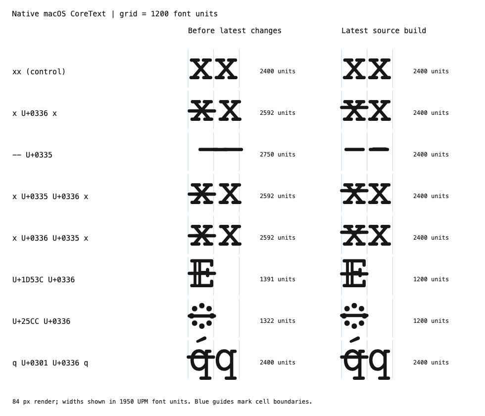
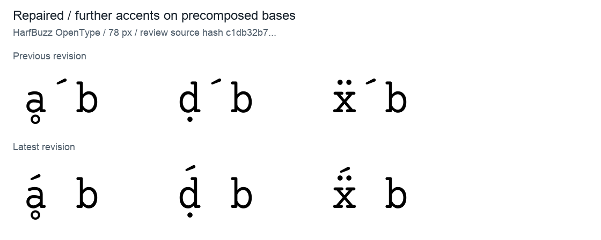
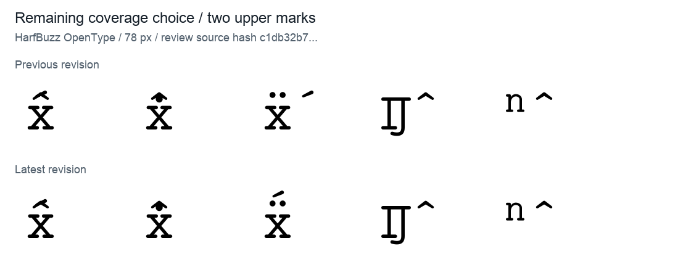

# Claude 第二轮修正复查

2026-09-29。检查当前 `00_Regular.sfd`（SHA-256 `c1db32b7…`），对照上一轮 `e566eaa9…` 的构建结果。此次仅检查和整理报告，没有改动字体源码或构建脚本。

**上次两项重点问题已在针对性测试中修复；没有发现普通编程文本或单字形轮廓回归。仍有少用组合、多重音标堆叠和一个 ZWJ 边界行为需要按支持范围判断。**

## 1. CoreText 删除线错位已修复

最新源码增加真正的 MarkToBase 附着，覆盖2203个基字形。相关定义位于[源码469行](../../00_Regular.sfd#L469)，两个删除线的锚点位于[81282行](../../00_Regular.sfd#L81282)和[81315行](../../00_Regular.sfd#L81315)。

原生 macOS CoreText 的14个针对性用例全部得到预期字宽：

- `x̶x`：2592 → **2400**，第二个 x 恢复到1200。
- `--̵`：2750 → **2400**。
- x 后接两种删除线的两种顺序：2592 → **2400**。
- 双线体 E 加删除线：1391 → **1200**；虚线圆加删除线：1322 → **1200**。

左侧为上一轮版本，右侧为最新源码构建。蓝线表示1200单位字符格，标注数字为原生CoreText测量的字体单位。图片按84px渲染；度量测试按1950 UPM测量。HarfBuzz OpenType也通过相应用例。[原生旧测量](evidence/coretext-before.txt)、[新测量](evidence/coretext-after.txt)。

进一步对1733个可打印、非组合符／控制符／空白字符，分别附加U+0336，在默认设置与58项可选特性下测试，共 **102247 组**，未发现字宽或附着异常。宽度预期与未加音标的实际排版结果比较，因此正确允许 U+2E3A / U+2E3B 等多格破折号。[汇总证据](evidence/overlay-feature-results.json)。该大规模扫描使用HarfBuzz，不冒充所有平台逐项实测。

## 2. 预组合字形继续添加重音已改善

上一轮明确失败的 `ḁ́`、`ḍ́ / ḍ́`、`ẍ́` 现在都能把后续acute放到正确位置，`ẍ́` 也取得垂直堆叠间距。相关锚点在[109895行](../../00_Regular.sfd#L109895)、[110152行](../../00_Regular.sfd#L110152)、[105192行](../../00_Regular.sfd#L105192)。

683个拉丁／希腊基字加circumflex的检查中，缺少定位的候选从 **72降为5**。剩余是 `IĴ、iĵ、ʹ̂、ͺ̂、ⁿ̂`，属于较少用的连字／修饰字符组合，且上一版就存在。不能把它们当作这次新增的5个错误。

## 3. 未发现字形损伤及常用排版回归

- 全部2229个源码字形的曲线、轮廓方向与闭合状态、组件引用、宽度、Unicode及前景边界均保持不变。
- 成品仍有2230个字形、1784个Unicode映射，零增删、零重映射。
- 变化集中于2205个字形的锚点记录，净增2338个锚点。
- 两版成品全部2230个字形，在相同FreeType渲染器、240px、显式关闭hinting及内嵌位图后，**逐像素完全一致**。该检查隔离单字形几何，组合文本定位另测。
- 61组编程样例与上一轮的字形选择和位置完全一致；58项非aalt特性语料／单字符检查未发现异常advance。
- 493组规范分解输入仍有25组glyph名称差异；名称差异不等于轮廓或语义错误，不重复误报。
- 两条输出路径的表解码、校验和、glyph读取正常；等宽识别、版本、码页、Ç组件度量、1627个带hinting指令的字形均保持正常。

详见[轮廓记录](evidence/source-findings.md)、[排版记录](evidence/shaping-findings.md)、[元数据记录](evidence/metadata-findings.md)。

## 4. 仍需你判断的支持范围

**多重上方音标尚未普遍支持。** `x̂́`、`x̂̄` 的两个上方音标仍处于同一高度，会重叠；`x̂̇` 也能看到相互挤占。circumflex目前有mark锚点，但缺少接收后续重音的basemark锚点，见[源码80949行](../../00_Regular.sfd#L80949)。这与已修好的“预组合字形＋重音”是两种不同情形，而且是原有局限。

图中前两例仍相互挤占，第三例 `ẍ́` 已修复，后两例为尚未支持的少用基字。若希望支持科学记号中连续叠加的帽子、点、横线，应进一步补充mark-to-mark定位；否则应明确当前支持的组合范围。具体音标间距也需要按造型审阅，不能由本次零宽检查代替。

**有一处新的控制符边界行为差异。** 人工构造 `x + U+200D ZWJ + U+0335` 时，HarfBuzz现在将overlay放在下一格；以前无条件横移恰好把它放在x上。其他锚点音标此前也不能跨该ZWJ正确定位，CoreText对此序列在两版都返回缺字。这是低使用率的边界回归，不应隐去，但不建议为保留旧偶然行为而撤销正确的附着修复。若要求拉丁组合音标跨显式ZWJ工作，应单独处理并增加测试。[旧新探针](evidence/stacking-control-probes.json)。

上面的5个少用基字组合也仍待支持。孤立U+0336在CoreText下仍有60单位的启发式平移，是旧有行为，不等同于已修好的“基字＋删除线”文本。

## 5. 构建与平台边界

正式输出仍应使用 [scripts/build.py](../../scripts/build.py)。它没有在本轮变化，本次实际构建通过。脚本输出的所有宽度均与SFD相符，有26个零宽字形；直接FontForge导出仍会将25个源码零宽字形写成1200。常见排版引擎会掩盖其中一部分，不能用简单预览替代该表检查。

高音标与ascent的旧取舍仍未调整：`Ő / Ű` 顶部1935、`ĺ` 顶部1974，ascent为1800。142个字形的LSB/xMin一单位差及head标志不一致也仍存在；均非此次新增。

**未进行原生Windows/Linux应用验收。** 此次有macOS原生CoreText实测和本机HarfBuzz/FreeType检查，尚不能宣称三平台正式发布验收全部通过。

精确输入哈希见[provenance.json](evidence/provenance.json)，元数据摘要见[metadata-summary.json](evidence/metadata-summary.json)。原生复现程序：[测量脚本](evidence/shape-coretext.swift)、[对照图脚本](evidence/render-coretext-comparison.swift)。脚本中的临时路径记录此次实验位置；重新复现时应传入待测字体路径。新生成的临时字体和大型中间文件保留在本次临时工作目录，没有重新建立仓库 `audit/`。
